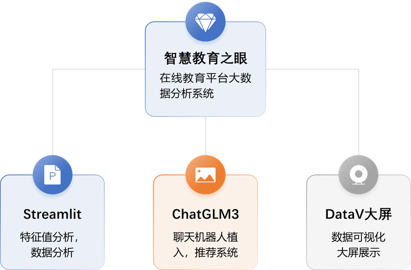
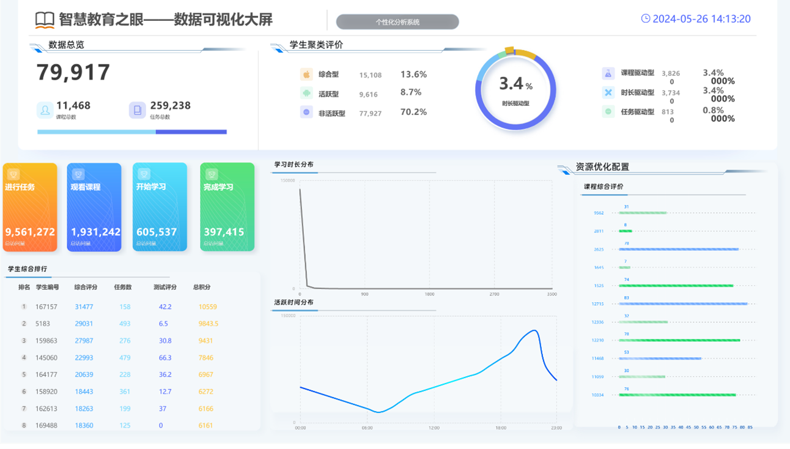
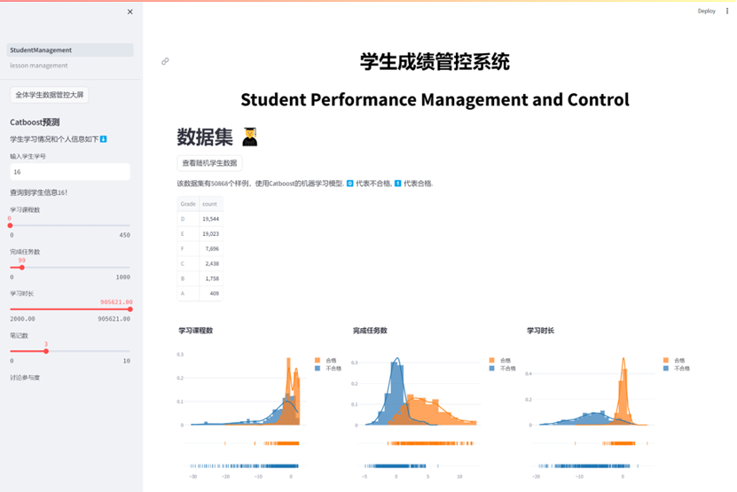
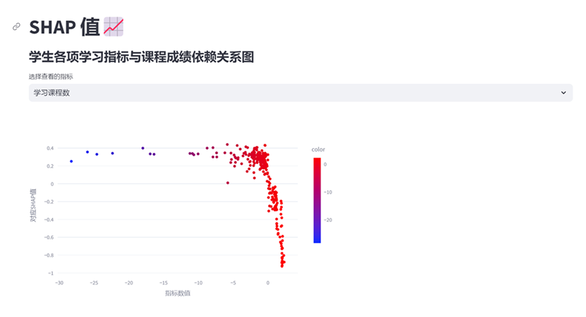
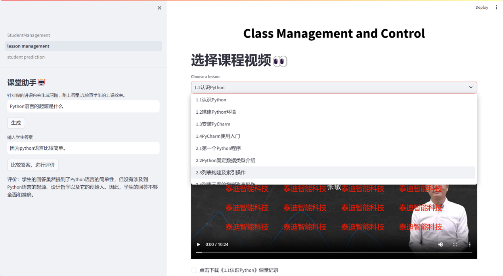
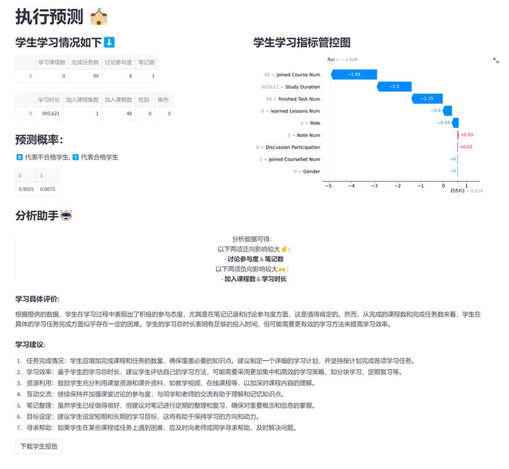
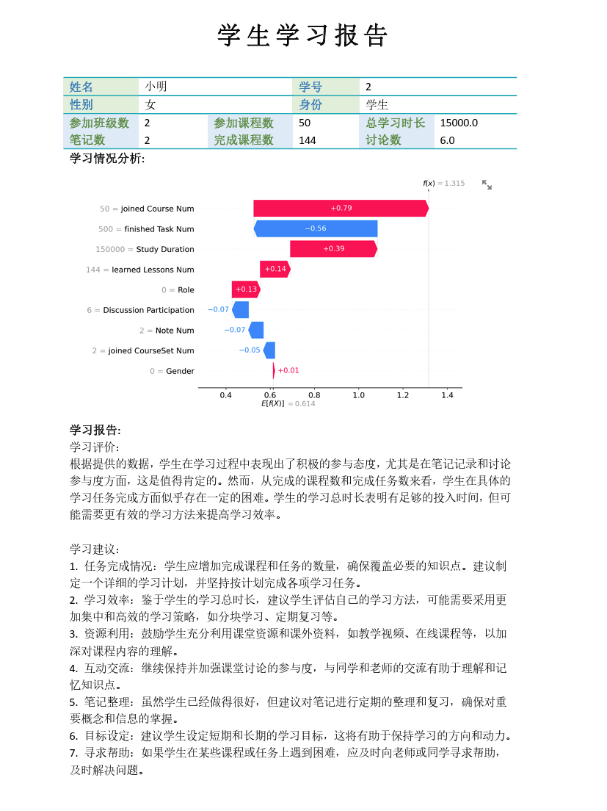

# 1 作品概述

## 1.1 创意来源与产生背景

随着信息技术的迅猛发展，数字化教育已成为全球教育领域的重要趋势。然而，教育机构面临的挑战在于如何高效利用海量的教育数据来优化教学方法和提升教育质量。针对这一需求，我们设计并实现了《智慧教育之眼》——一个综合的在线教育大数据分析系统。该系统旨在通过先进的数据处理技术和深度学习模型，提供实时的教育分析和决策支持，通过数据大屏与生成报告的直观展示方式，帮助教育机构实现教学资源的优化配置和教学效果的显著提升。

## 1.2 用户群体

《智慧教育之眼》主要面向教育机构，包括但不限于学校、在线教育平台以及政府教育部门。这些机构可以利用本系统来监控和分析学生的学习行为、课程效果及教师教学质量，进而调整教学策略和资源分配，实现教育质量的整体提升。

## 1.3 主要功能与特色

### 1.3.1 主要功能

数据处理与集成：利用PySpark进行高效的数据预处理和集成，确保数据质量和一致性。

深度学习分析：采用CatBoost和ChatGLM3-6B模型对教育数据进行深入的学习和预测，揭示学习行为和成绩表现的深层关联，并将结果以报告的形式生成反馈。

实时数据可视化：通过Streamlit和阿里云DataV技术实现教育数据的实时可视化，提供直观的数据分析报告和仪表板。

### 1.3.2 特色亮点

交互式数据探索：用户可以通过动态的数据大屏，实时探索和分析学生表现和教学效果；同时，也支持个性化学生预测报告的生成，以直观了解指定学生的学习情况。

模块化系统设计：系统采用模块化设计，支持快速技术迭代和功能拓展，适应不断变化的教育需求。

## 1.4 应用价值

《智慧教育之眼》通过精准的数据分析和实时的决策支持，能够帮助教育机构提升教学质量和学生学习效果，优化教育资源配置。此外，系统提供的数据驱动洞见可以促进个性化教学的实施，从而满足不同学生的学习需求，提高教育的普及性和平等性。

## 1.5 推广前景

随着教育信息化的不断推进和在线教育的普及，对于高效、智能的教育数据分析系统的需求日益增长。《智慧教育之眼》的开发符合当前教育数字化转型的大趋势，具有广阔的市场潜力和推广前景。未来，我们计划与更多教育机构合作，不断优化系统功能，为教育事业贡献力量。

# 第2章 问题分析

## 2.1 问题来源

在当前的教育领域中，随着在线学习平台和数字化课程的普及，大量的教育数据被持续生成。这些数据包括学生的学习行为记录、成绩数据、互动日志等，都蕴藏着优化教学过程和提升学习效果的潜力。然而，教育机构面临的挑战是如何有效地处理和分析这些数据，从而做出更精确的教育决策。传统的数据处理方法往往效率低下，难以满足实时分析的需求，且缺乏深入挖掘数据潜在价值的能力。

## 2.2 现有解决方案

目前市场上存在多种教育数据分析系统，能够提供基本的数据分析、报告生成和预测功能。然而，它们大多侧重于描述性统计，缺乏对数据的深度学习分析和实时处理能力。此外，现有解决方案往往不支持高度定制化的数据视图和交互式探索，这限制了用户根据具体需求进行数据分析的能力。

## 2.3 本作品要解决的痛点问题

《智慧教育之眼》系统针对现有解决方案中的几个核心痛点进行了创新性的优化和改进：

1. 实时数据处理能力：利用Apache Spark实现数据的实时处理和分析，解决了传统系统在处理大规模教育数据时的延迟问题。
2. 深度学习分析：通过集成CatBoost和ChatGLM3-6B等先进的机器学习模型，进行深入的数据分析和预测，超越了基本的统计分析，提供更精确的教学和学习效果预测，支持一键生成个性化报告。
3. 交互式数据可视化：结合Streamlit和阿里云DataV，提供动态的数据可视化和实时交互功能，提高了数据分析的灵活性和用户体验。

## 2.4 解决问题的思路

为了解决上述痛点问题，《智慧教育之眼》采取以下解决思路：

**功能和性能需求：**

系统需要能够处理高并发的数据查询和实时的数据更新，支持多种数据分析模型和可视化工具，并接入先进的大模型以生成个性化学生报告，增强可读性与交互性。

**数据集：**

使用的数据集包括学生的基本信息、学习活动记录、成绩数据等，来源于合作教育机构的教育平台。数据格式包括CSV和JSON，便于数据处理和分析。

**数据获取方式：**

通过APIs和直接从数据库同步数据，确保数据的实时性和准确性。

**数据特点与规模：**

数据量大，多样性高。例如，学习活动记录包括视频观看时长、作业提交时间等。

# 第3章 技术方案

## 3.1 技术方案概述

《智慧教育之眼》系统采用了一系列先进的技术和方法，整合数据处理、机器学习以及实时数据可视化，以支持教育机构在大数据环境下进行高效和精准的教育决策。系统的主要技术包括PySpark用于大数据处理，CatBoost和ChatGLM3-6B模型用于深度学习和数据预测、一键生成学生个性化预测报告，以及Streamlit和阿里云DataV用于交互式数据可视化。

## 3.2 技术功能框架图

 

图 1 技术功能框架图

## 3.3 技术方案详述

### 3.3.1 数据处理与集成（PySpark）

PySpark 是Apache Spark的Python API，用于处理大规模数据集。我们选择PySpark处理数据的原因在于其能够提供快速、通用的数据处理平台，支持多种数据源和复杂的数据操作。在《智慧教育之眼》系统中，PySpark负责执行以下任务：

数据预处理：清洗、格式化和转换输入数据，确保数据质量和一致性。

数据集成：合并来自不同数据源的数据，为分析提供统一的视图。

### 3.3.2 深度学习分析

CatBoost：

使用高性能的机器学习库，用于分析学生的学习成绩和行为模式，预测学生的学业表现。

ChatGLM3-6B：

作为一个先进的文本生成模型，ChatGLM3-6B在我们的系统中用于提升教育内容的互动性，提供定制化的学习建议和内容。

### 3.3.3 实时数据可视化与报告生成

Streamlit：

使用用于快速创建数据应用的开源框架。开发用户友好的前端界面，使非技术用户也能轻松进行复杂的数据分析，并支持自动问答评估答案、一键生成导出学生报告。

阿里云DataV：

构建动态的数据可视化大屏，以实时展示教育数据分析的结果，如学生表现的热力图、成绩分布图等，增强决策支持的直观性。

### 3.3.4 原创工作与非原创工作

**原创工作**

数据处理流程优化：自主开发了一系列PySpark脚本，用于优化教育数据的预处理和集成过程，提升数据处理效率和质量。

定制化分析与预测：基于CatBoost和ChatGLM3-6B模型的输出，开发了一套算法，用于为每个学生描绘个性化的学习情况，这是根据学生的历史表现和行为模式动态调整的。

**非原创工作**

使用现有的深度学习框架：采用了CatBoost和ChatGLM3-6B这两个开源模型，以支持数据的进一步分析与报告的生成。 

使用成熟的数据大屏展示框架：采用了阿里云DataV数据大屏为基础进行开发与对接，完成最终数据的展示。

# 第4章 系统实现

## 4.1 软件设计与实现

《智慧教育之眼》系统的设计遵循模块化和服务导向的架构原则，以确保系统的可扩展性、可维护性和高效性。

后端架构：系统后端采用微服务架构，使用Spring Boot框架进行实现。通过定义清晰的服务界面，各个模块如数据处理、分析和可视化模块能够独立运行和扩展，互不影响。

前端设计： Streamlit用于快速开发交互式的数据应用，而阿里云DataV用于动态数据可视化展示。

## 4.2 用户界面

 

图 2 DataV数据大屏展示

 

图 3 学生成绩管控系统-主界面

 

图 4 学生成绩管控系统-依赖关系分析界面

 

图 5 学生成绩管控系统-课堂助手界面

 

图 6 学生成绩管控系统-预测与报告生成界面

 

图 7 学生成绩管控系统-生成ai报告结果

## 4.3 数据来源与处理

数据来源：数据来自合作的教育机构，包括学生信息、成绩数据、课程互动记录等。

数据预处理：使用PySpark进行数据清洗、格式化和转换。处理过程中强调数据的准确性和一致性，以支持后续的分析准确性。

## 4.4 数据训练与模型优化

模型训练：利用CatBoost和ChatGLM3-6B进行模型训练。使用真实的教育数据集进行训练，以调整模型参数，达到最优预测性能。

改进过程：在初期模型训练后，通过交叉验证和参数调优改进模型性能。特别是对CatBoost模型，进行了深度特征工程和超参数优化，以提高模型的预测准确率和响应速度。

## 4.5 系统部署与运维

部署方法：系统部署在Unbuntu云服务器上，确保环境一致性和快速部署。

运维：系统前后端分离设计，确保系统在高负载时的稳定性。

## 4.6 遇到的困难与解决方法

数据的大规模处理：初期系统处理大规模数据时响应缓慢。通过引入Apache Spark进行数据处理，并优化了数据存储结构和查询算法，显著提高了处理速度。

模型训练的资源限制：模型训练初期由于资源限制导致训练时间过长。解决方法是使用GPU加速训练过程，并在云平台上分配更多资源。

## 4.7 技术的增量部分

系统的增量技术部分主要体现在：

实时数据处理与分析：通过整合PySpark与实时数据流技术，实现了数据的实时处理与分析，这在传统教育分析系统中较少见。

交互式与动态可视化：结合Streamlit和阿里云DataV创新实现了高度交互性和动态性的数据可视化，为用户提供了前所未有的数据探索体验。

# 第5章 测试分析

## 5.1 验证数据的来源与规模

为确保测试结果的准确性和可靠性，《智慧教育之眼》系统的验证使用来自合作教育机构的实际教育数据进行。数据包括：

表 1 数据集说明

| 表名                        | 数据量        | 说明                                             |
| --------------------------- | ------------- | ------------------------------------------------ |
| course_chapter              | 不少于310000  | 课程章节表，包含课程ID和章节内容等信息           |
| course_task                 | 不少于250000  | 课程任务表，包含课程ID和课程任务等信息           |
| classroom_member            | 不少于110000  | 班级成员表，包含班级ID和用户ID等信息             |
| classroom_courses           | 不少于9000    | 班级课程表，包含班级ID和课程ID等信息             |
| log                         | 不少于1000000 | 日志表，包括日志操作人ID和登录日志等信息         |
| user_learn_statistics_total | 不少于140000  | 用户学习统计表，包含用户ID和学习相关统计等信息   |
| activity_learn_log          | 不少于1000000 | 学习日志表，包括用户ID和学习日志等信息           |
| testpaper                   | 不少于12000   | 试卷信息表，包括试卷名称和创建试卷等信息         |
| testpaper_result            | 不少于340000  | 试卷结果表，包括试卷名称、用户ID和试卷分数等信息 |

 

这些数据被用于构建和训练模型，同时作为系统功能和性能评估的基础。

## 5.2 测试过程

测试过程分为三个主要阶段：

（1）功能测试

确保系统的每个模块如数据处理、分析预测和可视化都按预定功能正常运行。

（2）性能测试

评估系统处理大规模数据的能力，包括响应时间和数据处理速度。

（3）验收测试

由实际用户操作系统完成特定任务，并提供使用体验的反馈。

## 5.3 分析与结论

### 5.3.1 性能评估

（1）数据处理速度

《智慧教育之眼》使用PySpark处理相同规模数据响应速度在合理范围内。

（2）预测准确性

通过CatBoost和ChatGLM3-6B模型进行的学习成绩预测，准确性达到预期。 

### 5.3.2 用户反馈

用户反馈主要集中在系统的易用性和交互设计上。测试用户表示，《智慧教育之眼》的用户界面直观易用，数据可视化功能尤其受到好评。教师用户反映，系统提供的分析报告和学生表现预测对教学调整非常有帮助。

## 5.4 结论

测试结果证明，《智慧教育之眼》系统在数据处理速度、分析准确性和用户体验方面均达成预期目的。系统的模块化设计和高度的可定制性使其有望成为支持教育决策的有力工具。未来，随着更多教育机构的应用和更多反馈的收集，系统将继续优化，以满足更广泛的教育分析需求。

# 第6章 作品总结

## 6.1 作品特色与创新点

《智慧教育之眼》系统融合了最新的大数据处理技术、机器学习模型以及交互式数据可视化技术，为教育机构提供了一个前所未有的教育数据分析平台。其主要创新点和特色包括：

（1）高效的数据处理

通过利用Apache Spark的PySpark模块，系统能够快速处理和分析大规模教育数据集，显著提升数据处理效率。

（2）深度学习集成

集成了CatBoost和ChatGLM3-6B等先进的机器学习模型，不仅提高了学习成绩和行为预测的准确性，还能根据学生的行为和反馈提供个性化的学习建议。

（3）动态数据可视化

结合Streamlit和阿里云DataV提供的实时、动态的数据可视化，支持自动问答和答案评估，支持将输入与输出数据通过ai大模型转化生成报告，极大地增强了用户体验，使得非技术用户也能使用大模型进行辅助、轻松获取数据分析结果。

## 6.2 应用推广

《智慧教育之眼》系统的应用前景广阔，具体的推广策略包括：

（1）合作与整合

与更多教育机构合作，将系统整合到现有的教育管理系统中，提供定制化的数据分析服务。

（2）市场拓展

针对不同级别的教育机构（如高中、大学及职业培训中心）进行市场分割和产品调整，以满足各类机构的特定需求。

（3）国际化发展

将系统本地化，适应不同国家和地区的教育数据特点和用户习惯，推广至全球市场。

## 6.3 作品展望

对于《智慧教育之眼》的未来发展，我们有以下几点展望：

（1）技术迭代

继续跟踪和集成最新的数据科学和人工智能技术，如引入自然语言处理（NLP）技术来分析学生的文字反馈，增强系统的分析能力。

（2）用户体验优化

基于用户反馈，不断优化用户界面和交互设计，使系统更加直观易用。

（3）数据安全与隐私保护

加强数据安全措施，确保用户数据的隐私和安全，符合国际数据保护标准，尤其是在处理敏感的学生信息时。

 

总体而言，《智慧教育之眼》系统在技术创新和应用实践方面展现了巨大的潜力和价值。通过不断的技术改进和市场推广，该系统有望在教育领域发挥更大的影响力，助力教育机构实现教学和管理的现代化。